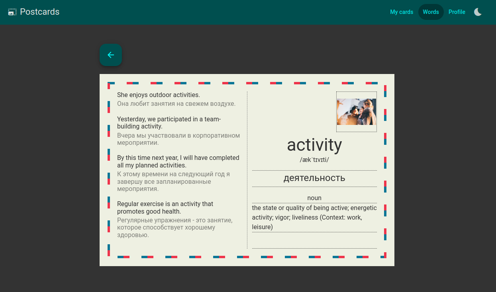

# Postcards

This project was generated with [Angular CLI](https://github.com/angular/angular-cli) version 17.3.4.

The application uses the [Feature-sliced design](https://feature-sliced.design/) architecture.

## Development server

Run `ng serve` for a dev server. Navigate to `http://localhost:4200/`. The application will automatically reload if you change any of the source files.

## Build

Run `ng build` to build the project. The build artifacts will be stored in the `dist/` directory.

## Deploy

Run `make deploy` to deploy the project to docker hub

## App

[Link](http://postcardify.online/)

An application for learning English words stylized as postcards. It contains words divided into categories by language levels.

### ToDo

-   Improve UX
-   Exercises for repeat vocabulary
-   Setting repeat parameters
-   Tests
-   Mobile app
